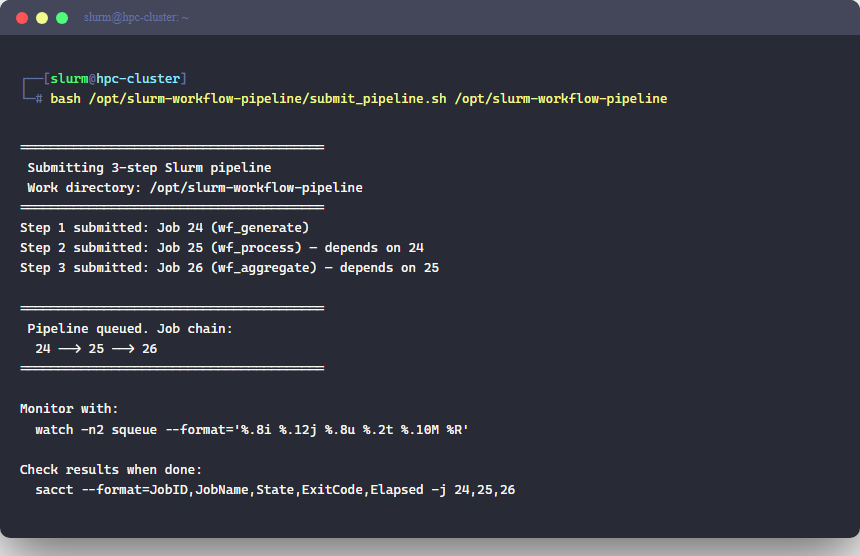
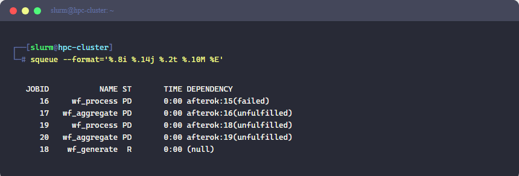
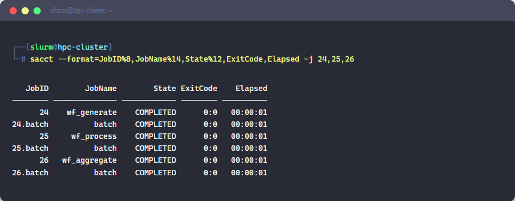
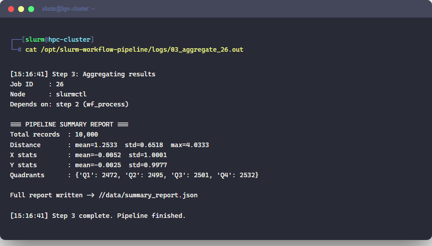

# slurm-workflow-pipeline

A 3-step data processing pipeline where each Slurm job only starts after the previous one exits successfully (`--dependency=afterok`). Demonstrates how to wire together independent steps into a reliable, crash-aware workflow without a separate workflow manager.

## Architecture

```
sbatch step1  ──afterok──▶  sbatch step2  ──afterok──▶  sbatch step3
  wf_generate                 wf_process                 wf_aggregate
  (generate 10k               (compute                   (statistical
   data points)                features)                  report)
```

If step 1 fails, Slurm automatically marks steps 2 and 3 as `DependencyNeverSatisfied` and they never run — no wasted resources.

## Files

```
submit_pipeline.sh        # One-shot launcher: submits all 3 jobs with dependency chain
steps/
  01_generate_data.sh     # Step 1: generate 10,000 synthetic 2D data points
  02_process_data.sh      # Step 2: compute distance, angle, quadrant per point
  03_aggregate.sh         # Step 3: statistical summary report
```

## Submitting the pipeline

```bash
bash submit_pipeline.sh /path/to/workdir
```

### Submission output — job chain



## How `--dependency=afterok` works

```bash
JOB1=$(sbatch step1.sh | awk '{print $NF}')
JOB2=$(sbatch --dependency=afterok:$JOB1 step2.sh | awk '{print $NF}')
JOB3=$(sbatch --dependency=afterok:$JOB2 step3.sh | awk '{print $NF}')
```

- `afterok:JOBID` — start only if JOBID exited with code 0
- `afterany:JOBID` — start regardless of exit code
- `afternotok:JOBID` — start only if JOBID failed (useful for error-handling jobs)
- Multiple deps: `--dependency=afterok:1:2:3` (all must succeed)

### Queue showing dependency states



The `(failed)` annotation on a dependency tells you exactly *why* a downstream job is stuck — here an earlier run failed so jobs 16/17 were never going to run.

## Pipeline results

### sacct — all 3 steps completed



### Step 3 output — final aggregation report



The pipeline processed 10,000 points and produced:
- Mean distance from origin: **1.2533** (expected ≈ √(π/2) ≈ 1.2533 for 2D Gaussian ✓)
- Near-uniform quadrant distribution (≈25% per quadrant)
- Full JSON report written to `data/summary_report.json`

## Extending the pipeline

**Fan-out (parallel steps):** Submit multiple step-2 variants with the same `afterok:$JOB1` dependency — they all start once step 1 completes and run concurrently.

**Fan-in (barrier):** Use `afterok:$JOB2A:$JOB2B` to wait for multiple parallel jobs before running the final aggregation.

```bash
JOB2A=$(sbatch --dependency=afterok:$JOB1 step2a.sh | awk '{print $NF}')
JOB2B=$(sbatch --dependency=afterok:$JOB1 step2b.sh | awk '{print $NF}')
JOB3=$(sbatch --dependency=afterok:$JOB2A:$JOB2B step3.sh | awk '{print $NF}')
```
